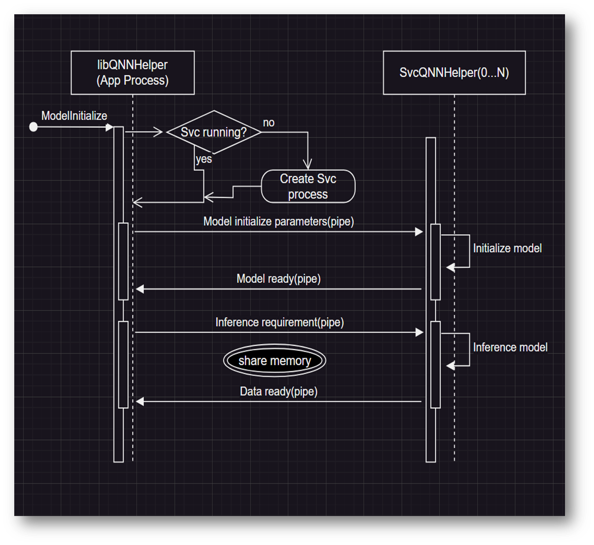
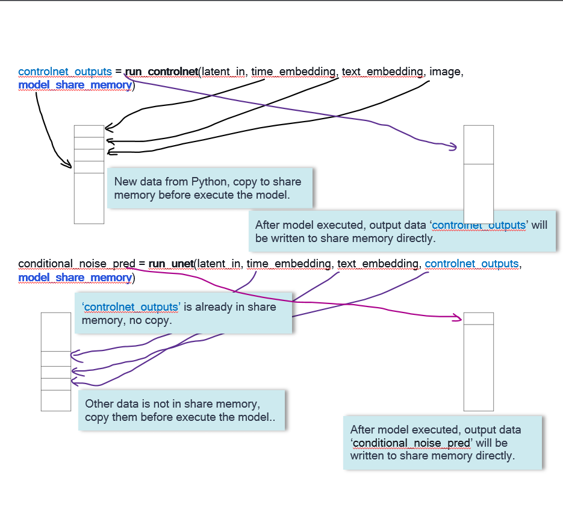

# User Guide

## Environment Setup

### 1. Libraries from QNN SDK:

<b>We need below libraries from QNN SDK for using QNNHelper on Snapdragon X Elite(Windows on Snapdragon device):</b>

```
C:\Qualcomm\AIStack\QAIRT\{SDK Version}\lib\aarch64-windows-msvc\QnnHtp.dll  (backend for running model on HTP)
C:\Qualcomm\AIStack\QAIRT\{SDK Version}\lib\aarch64-windows-msvc\QnnCpu.dll  (backend for running model on CPU)
C:\Qualcomm\AIStack\QAIRT\{SDK Version}\lib\aarch64-windows-msvc\QnnHtpPrepare.dll
C:\Qualcomm\AIStack\QAIRT\{SDK Version}\lib\aarch64-windows-msvc\QnnSystem.dll
C:\Qualcomm\AIStack\QAIRT\{SDK Version}\lib\aarch64-windows-msvc\QnnHtpV73Stub.dll
C:\Qualcomm\AIStack\QAIRT\{SDK Version}\lib\hexagon-v73\unsigned\libQnnHtpV73Skel.so
C:\Qualcomm\AIStack\QAIRT\{SDK Version}\lib\hexagon-v73\unsigned\libqnnhtpv73.cat
```

We can copy these libraries to one folder. E.g.: ```C:\<Project Name>\qnn_assets\QNN_binaries\``` <br>

### 2. Python and common python extensions: 
Get ARM64 version 'python-3.11.5-arm64.exe' from below link and install it:
https://www.python.org/ftp/python/3.11.5/python-3.11.5-arm64.exe

Get common Python extensions such as NumPy, OpenCV, Pillow from here:
https://github.com/cgohlke/win_arm64-wheels/

Get PyQt6 from here:
https://github.com/RockLakeGrass/Windows-on-ARM64-Toolchain/tree/main/Python/packages/PyQt/PyQt6 

### 3. PyTorch, TorchVision, ONNX, ONNX Runtime:
If need these Python extensioins for ARM64 Python, you need compile them by yourselves. If need support on how to compile them, you can contact with us.

### 4. MSVC library: 
You need ARM64 version 'msvcp140.dll' from 'Microsoft Visual C++ 2022 Redistributable (Arm64)'. You can download it from here and install it:
https://aka.ms/arm64previewredist/

### 5. Notes: <br>
a. For C++(Visual Studio) projects, you need to set 'Runtime Library' to 'Multi-threaded DLL (/MD)'. Please refer to below link for detailed information:
https://learn.microsoft.com/en-us/cpp/build/reference/md-mt-ld-use-run-time-library?view=msvc-170

b. Plese use the API *LogLevel.SetLogLevel()* for Python and *SetLogLevel()* for C++ to initialize the log function before you call any other APIs. 

## API from 'libqnnhelper.dll' for C++ projects.

##### bool LibQNNHelper::ModelInitialize(...) <br>
*std::string model_name*: Model name such as "unet", "text_encoder", "controlnet_canny". Model name must be unique for different model files. <br>
*std::string proc_name*: This is an optional parameter, needed just when you want the model to be executed in a separate process. If use process name, this model will be loaded in 'SvcQNNHelper' service process. One service process can load many models. There can be many service processes. <br>
*std::string model_path*: The path of model. <br>
*std::string backend_lib_path*: The path of 'QnnHtp.dll' <br>
*std::string system_lib_path*: The path of 'QnnSystem.dll' <br>

##### bool LibQNNHelper::ModelInference(...) <br>
*std::string model_name*: Model name used in 'ModelInference'. <br>
*std::string proc_name*: Process name used in 'ModelInference'. This is an optional parameter, needed  just when you want the model to be executed in a separate process. <br>
*std::string share_memory_name*: Share memory name used in 'CreateShareMemory'. This is an optional parameter, use it with 'proc_name' together. <br>
*std::vector<uint8_t*>& inputBuffers*: All input data required for the model. <br>
*std::vector<size_t>& inputSize*: The size of input data in 'inputBuffers'. This is an optional parameter, use it with 'proc_name' together. <br>
*std::vector<uint8_t*>& outputBuffers*: Used to save all the output data of the model. <br>
*std::vector<size_t>& outputSize*: The size of output data in 'outputBuffers'. <br>

##### bool LibQNNHelper::ModelDestroy(...) <br>
*std::string model_name*: Model name used in 'ModelInference'. <br>
*std::string proc_name*: Process name used in 'ModelInference'. This is an optional parameter, needed just when you want the model to be executed in a separate process. <br>

##### bool LibQNNHelper::CreateShareMemory(...) <br>
*std::string share_memory_name*: Share memory name. This share memory will be used to store model input & output data. <br>
*size_t share_memory_size*: The one with the larger memory size of the model input and output data. For example: total size of model input data size is 10M, out put data size is 16M, we can set 'share_memory_size' to 16M. <br>

##### bool LibQNNHelper::DeleteShareMemory(...) <br>
*std::string share_memory_name*: Share memory name. <br>

##### Helper function for printing log: <br>
bool SetLogLevel(int32_t log_level) <br>
void QNN_ERR(const char* fmt, ...) <br>
void QNN_WAR(const char* fmt, ...) <br>
void QNN_INF(const char* fmt, ...) <br>
void QNN_VEB(const char* fmt, ...) <br>
void QNN_DBG(const char* fmt, ...) <br>

- log_level: 
```
    QNN_LOG_LEVEL_ERROR   = 1 
    QNN_LOG_LEVEL_WARN    = 2 
    QNN_LOG_LEVEL_INFO    = 3 
    QNN_LOG_LEVEL_VERBOSE = 4 
    QNN_LOG_LEVEL_DEBUG   = 5 
```

## Sample Code(C++: load model to local process.)

```
#include "LibQNNHelper.hpp"

LibQNNHelper libQNNHelper;
SetLogLevel(2);
std::vector<uint8_t*> inputBuffers;
std::vector<uint8_t*> outputBuffers;
std::vector<size_t> outputSize;

libQNNHelper.ModelInitialize(model_name, model_path, backend_lib_path, system_lib_path);

// Fill the inputBuffers before inference.
... 

libQNNHelper.ModelInference(model_name, inputBuffers, outputBuffers, outputSize);

// Use the data in outputBuffers.
... 

// Free the memory in outputBuffers.
for (int j = 0; j < outputBuffers.size(); j++) {
    free(outputBuffers[j]);
}
outputBuffers.clear();
outputSize.clear();

libQNNHelper.ModelDestroy(model_name);
```

## Sample Code(C++: load model to ‘SvcQNNHelper’ process.)

```
#include "LibQNNHelper.hpp"

LibQNNHelper libQNNHelper;
SetLogLevel(2);
std::vector<uint8_t*> inputBuffers;
std::vector<size_t> inputSize;
std::vector<uint8_t*> outputBuffers;
std::vector<size_t> outputSize;

libQNNHelper.CreateShareMemory(model_memory_name, MODEL_SHAREMEM_SIZE);
libQNNHelper.ModelInitialize(model_name, proc_name, model_path, backend_lib_path, system_lib_path);

// Fill the inputBuffers before inference.
... 

libQNNHelper.ModelInference(model_name, proc_name, model_memory_name, inputBuffers, inputSize, 
                            outputBuffers, outputSize);

// Use the data in outputBuffers. 
... 

// The data is in share memory, we don’t need to free it immediately if we still need to use it.
libQNNHelper.ModelDestroy(model_name, proc_name);
libQNNHelper.DeleteShareMemory(model_memory_name);  // Free the memory here.
```

## API from QNNHelper Python binding extension for Python projects.<br>
There're several Python classes from this extension:
- QNNContext - The context of QNN model, used to initialize the QNN model, run the inference and destroy the model resource.
- QNNContextProc - It's similar with QNNContext but support load the model into a separate processes.
- QNNShareMemory - It's used to create processes share memory while using *QNNContextProc*.
- QNNConfig - It's for configuring  QNN SDK libraries path, runtime(CPU/HTP), log leverl, profiling level.
- PerfProfile - Set the HTP perf profile.
## Sample Code(Python)

```
from qnnhelper import (QNNContext, Runtime, LogLevel, ProfilingLevel, PerfProfile, QNNConfig)
import os

execution_ws = os.getcwd()
des_dir = execution_ws + "\\qnn_assets\\QNN_binaries"

def SetQNNConfig():
    QNNConfig.Config(des_dir, Runtime.HTP, LogLevel.DEBUG, ProfilingLevel.BASIC)

class TextEncoder(QNNContext):
    #@timer
    def Inference(self, input_data):
        input_datas=[input_data]
        output_data = super().Inference(input_datas)[0]

        # Output of Text encoder should be of shape (1, 77, 768)
        output_data = output_data.reshape((1, 77, 768))
        return output_data

SetQNNConfig()  # We need to call this function to configure the basic environment before using any other QNNHelper functions.

model_text_encoder  = "text_encoder"
text_encoder_model = "models\\text_encoder_quantized.serialized.v73.bin"

# Instance for TextEncoder 
text_encoder = TextEncoder(model_text_encoder, text_encoder_model)

# Burst the HTP before inference.
PerfProfile.SetPerfProfileGlobal(PerfProfile.BURST)

# Run the inference of text encoder on tokens.
user_text_embedding = text_encoder.Inference(tokens)

# Release the HTP.
PerfProfile.RelPerfProfileGlobal()

# Destroy the model and free the memory resource.
del(text_encoder)
```

## Multi-Processes
<b>There is no limit to the number of ‘SvcQNNHelper’ processes.</b>



## Share Memory
<b>Minimize memory copies.</b>


