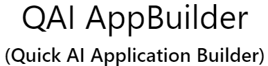
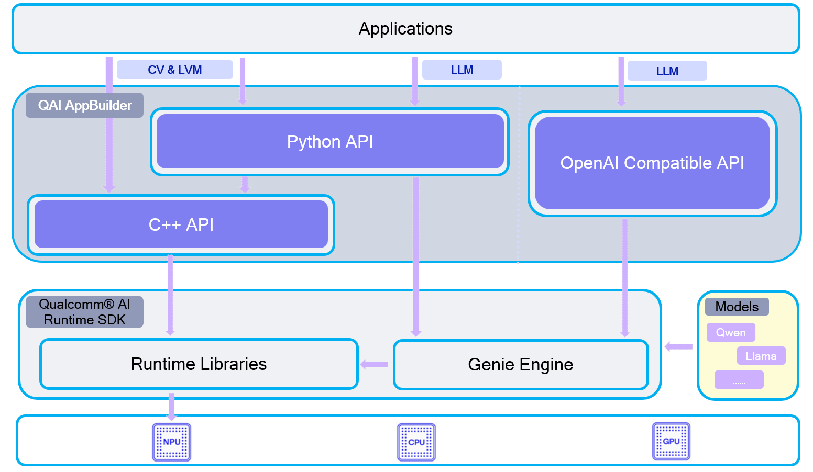

<br><br><br>

<div align="center">
  <a href="README.md"></a>
</div>

<br><br><br>

<div align="center">
  <h3>A simple way to build AI application based on Qualcomm® AI Runtime SDK.</h3>
  <p><i> SIMPLE | EASY | FAST </i></p>
  <a href="https://github.com/quic/ai-engine-direct-helper"></a>
  <a href="https://github.com/quic/ai-engine-direct-helper/releases/tag/v2.38.0"></a>
  <a href="https://opensource.org/license/BSD-3-clause"></a>
  <a href="https://www.python.org/downloads/windows/"></a>
  <a href="https://en.cppreference.com/w/cpp/compiler_support"></a>
  <a href="https://www.qualcomm.com/products/technology/processors/ai-engine"></a>
  <a href="https://github.com/quic/ai-hub-apps/tree/main/tutorials/llm_on_genie"></a>
</div>
<br>

---

## Disclaimer
This software is provided “as is,” without any express or implied warranties. The authors and contributors shall not be held liable for any damages arising from its use. The code may be incomplete or insufficiently tested. Users are solely responsible for evaluating its suitability and assume all associated risks. <br>
Note: Contributions are welcome. Please ensure thorough testing before deploying in critical systems.

## QAI AppBuilder
The Quick AI Application Builder (this repository) is also referred to as "QAI AppBuilder" in the source code and documentation.<br>
QAI AppBuilder is an extension of the Qualcomm® AI Runtime SDK, which is used to simplify the deployment of QNN models. Some libraries from the Qualcomm® AI Runtime SDK are required to use QAI AppBuilder.<br>
QAI AppBuilder is designed to help developers easily use the Qualcomm® AI Runtime SDK to execute models on Windows on Snapdragon (WoS) and Linux platforms. It encapsulates the model execution APIs into a set of simplified interfaces for loading models onto the NPU/HTP and performing inference. It substantially lowers the complexity of model deployment for developers.

## QAI AppBuilder Launcher
We provide a wealth of samples to help you quickly explore the features of QAI AppBuilder. For some key examples, we also offer scripts to assist in setting up the relevant environment efficiently. You can learn how to use these scripts through [QAI AppBuilder Launcher](tools/launcher/), enabling you to experience the core functionalities within an hour.

## Blog & Documentation
[QAI AppBuilder Guide](docs/guide_en.md) [English](docs/guide_en.md) | [中文](docs/guide_zh.md) <br>
[GenieAPIService (OpenAI Compatible API Service)](docs/genie_guide_en.md) [English](docs/genie_guide_en.md) | [中文](docs/genie_guide_zh.md) <br>
[QAI AppBuilder: 让本地 AI 部署触手可及！](https://docs.qualcomm.com/bundle/publicresource/80-94755-1_REV_AA_QAI_AppBuilder_-_WoS.pdf) <br>
[大语言模型系列(1): 3分钟上手，在骁龙AI PC上部署DeepSeek!](https://blog.csdn.net/csdnsqst0050/article/details/149425691) <br>
[大语言模型系列(2): 本地 OpenAI 兼容 API 服务的配置与部署](https://blog.csdn.net/csdnsqst0050/article/details/150208814) <br>
[大语言模型系列(3): Qwen2.5-VL-3B 多模态模型端侧部署](https://blog.csdn.net/csdnsqst0050/article/details/157474571) <br>
[高通平台大语言模型精选](https://www.aidevhome.com/?id=51) <br>
[QAI AppBuilder on Linux (QCS6490)](https://docs.radxa.com/en/dragon/q6a/app-dev/npu-dev/qai-appbuilder) <br>
[Qwen2 7B SSD 使用教程](https://www.aidevhome.com/?id=29) <br>
[Qwen2.5 3B 使用教程](https://www.aidevhome.com/?id=36) <br>
[Genie API Service 配置与使用](https://www.aidevhome.com/?id=52) <br>
[GenieChat：使用 Genie API Service 构建本地大语言模型驱动的安卓应用](https://www.aidevhome.com/?id=50) <br>
[SuperResolutionApp：图片超分 Android 开发示例](https://www.aidevhome.com/?id=53) <br>
[BGE-Base-Zh-V1.5 端侧使用教程](https://www.aidevhome.com/?id=54) <br>

## Advantage

Developers can use QAI AppBuilder in both C++ and Python projects <br>

• Support both C++ & Python <br>
• Support both Windows & Linux <br>
• Support Genie(Large Language Model) <br>
• Support LLM on both CPU & NPU [*NEW!*] <br>
• Support Multimodal LLM [*NEW!*] <br>
• Support Float & Native Input & Output Data [*NEW!*] <br>
• Support Multi Graph <br>
• Support LoRA <br> 
• Support multiple models <br>
• Support multiple inputs & outputs <br>
• Easier for developing apps <br>
• Faster for testing models <br>
• Plenty of sample code <br>

** Support ARM64 Windows, Linux and Ubuntu (e.g.: X Elite Windows, QCS8550 Linux and QCM6490 Ubuntu). <br>
** Support OpenAI Compatible API Service([GenieAPIService](samples/genie/c++/README.md)) on WoS, Android and Linux. <br>
** Use "native" mode input & output data can improve data conversation performance obviously. Refer to [User Guide](https://github.com/quic/ai-engine-direct-helper/blob/main/docs/user_guide.md#native-mode) & [Wisper](samples/python/whisper_base_en/whisper_base_en.py) sample code. <br>

## Diagram
<br>
<div align="center">
  <a href="README.md"></a>
</div>

## Environment Setup
Refere to [python.md](docs/python.md) for instructions on setting up the Python(x64 version) environment to use QAI AppBuilder on Windows on Snapdragon (WoS) platforms. <br>
You can also run the batch file from [QAI AppBuilder Launcher](tools/launcher/) to setup the environment automatically.

## WebUI AI Application
We have developed several [WebUI AI applications](samples/webui/README.md) based on QAI AppBuilder, allowing you to experience them quickly. <br>
All these applications run on a local PC, requiring *no internet connection* and are *completely free*. <br>
You can run WebUI AI applications througn the batch file [3.Start_WebUI.bat](tools/launcher/).
<br><br>
<a href="samples/webui/README.md"></a>

|  App   | Description  |
|  ----  | :----    |
| ImageRepairApp | An image restoration tool designed to repair old or damaged photographs. |
| StableDiffusionApp  | A text-to-image generation tool that creates images based on user input. |
| GenieWebUI  | A large language model (LLM) interface that enables interactive conversations.|

## OpenAI Compatible API Service (GenieAPIService):<br>
Considering that the current mainstream method for invoking LLMs is based on OpenAI-compatible APIs, we have implemented such interfaces in both C++ and Python. This allows application developers to interact with the local large language model running on NPU in a familiar way. <br>
Many third-party applications that support the OpenAI API can seamlessly switch to the local NPU-based model by simply changing the API IP endpoint. <br>
We have also implemented the client sample code of Genie API Service through both C++ and Python for the reference of developers.

1. [Python based service](samples/genie/python/README.md): Guide to run OpenAI compatible API services developed with python.<br>
2. [C++ based service](samples/genie/c++/README.md): Guide to run OpenAI compatible API services developed with C++.<br>

## Samples
We have many [Python](samples/python/README.md) and [C++](samples/c++/) samples which can be run directly. The models used in these samples are from [AI-Hub](https://aihub.qualcomm.com/compute/models).<br>
*We suggest that you try to run these sample code before you actually start writing your own code.*<br>

## Tools
###  1. LangFlow Package
We have [LangFlow Package](tools/langflow/) for running QNN model in 3rd party [LangFlow](https://github.com/langflow-ai/langflow) framework. You can get more information [here](tools/langflow/).

### 2. QAI AppBuilder Launcher
We provide [QAI AppBuilder Launcher](tools/launcher/), enabling you to experience the core functionalities of QAI AppBuilder within an hour.

### 3. DLC2BIN
[DLC2BIN](./tools/convert/dlc2bin/) is a guide to help you convert the general DLC model format into the BIN format optimized for a specific platform.

### 4. ONNX2BIN
[ONNX2BIN](./tools/convert/onnx2bin/) is a guide to help you convert the ONNX model format into the BIN format optimized for a specific platform.

## Models
### Model Hub
[AI Hub](https://aihub.qualcomm.com/compute/models) <br>
[AI Dev Home](https://www.aidevhome.com/data/models/) <br>

### LLM Models
[Qwen2 7B SSD](https://www.aidevhome.com/data/adh2/models/8380/qwen2_7b_ssd_250702.html) <br>
[DeepSeek-R1-Distill-Qwen-7B](https://aiot.aidlux.com/zh/models/detail/78) <br>

## Thrid Party App List
[stable-diffusion-webui Extension](https://github.com/quic/wos-ai-plugins/tree/main/plugins/stable-diffusion-webui/qairt_accelerate) <br>
[Blender ControlNet Plugin](https://github.com/quic/wos-ai-plugins/tree/main/plugins/blender/SnapdragonImageGeneration) <br>
[无痕修图软件](https://www.aidevhome.com/?id=30) <br>
[图片超分器](https://www.aidevhome.com/?id=5) <br>
[图片超分应用](https://www.aidevhome.com/?id=37) <br>
[视频超分应用](https://www.aidevhome.com/?id=44) <br>
[图片消除器](https://www.aidevhome.com/?id=4) <br>
[图片搜索应用](https://www.aidevhome.com/?id=31) <br>

## QAI AppBuilder Components
There're two ways to use QAI AppBuilder:
### 1. Using the QAI AppBuilder C++ libraries to develop C++ based AI application.
Download prebuild binary package *QAI_AppBuilder-win_arm64-{Qualcomm® AI Runtime SDK version}-Release.zip* to get these files: https://github.com/quic/ai-engine-direct-helper/releases

### 2. Using the QAI AppBuilder Python binding extension to develop Python based AI application.
Download Python extension *qai_appbuilder-{version}-cp312-cp312-win_amd64.whl* and install it with the command below:
https://github.com/quic/ai-engine-direct-helper/releases

```
pip install qai_appbuilder-{version}-cp312-cp312-win_amd64.whl
```

## User Guide
Refere to [User Guide](docs/user_guide.md) on how to use QAI AppBuilder to program AI application. <br>
Refer to [tutorial.ipynb](docs/tutorial.ipynb) to setup and run a cv model step by step.

## Build
You can use the pre-compiled version directly and download the version you need from [Release](https://github.com/quic/ai-engine-direct-helper/releases). But if you really want to compile it yourself, you can refer to the [BUILD.md](BUILD.md).

## License
QAI AppBuilder is licensed under the BSD 3-clause "New" or "Revised" License. Check out the [LICENSE](LICENSE) for more details.

## Star History

<a href="https://www.star-history.com/#quic/ai-engine-direct-helper&Date">
 <picture>
   <source media="(prefers-color-scheme: dark)" srcset="https://api.star-history.com/svg?repos=quic/ai-engine-direct-helper&type=Date&theme=dark" />
   <source media="(prefers-color-scheme: light)" srcset="https://api.star-history.com/svg?repos=quic/ai-engine-direct-helper&type=Date" />
   
 </picture>
</a>