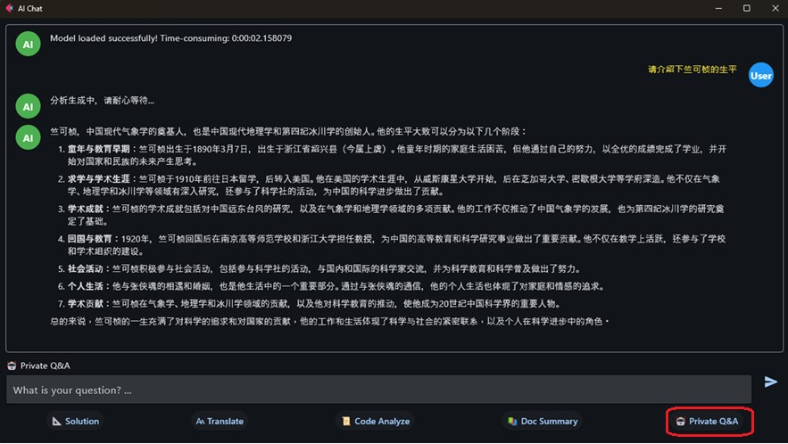

# GenieFletUI Windows guide

GenieFletUI is an AI chat assistant. This is Windows version, which supports richer features, especially supports RAG (shown as "🤖 Private Q&A").

## Environment setup

Step 1. Install python 3.12 or above.<br>
Step 2. Install necessary python module. Recommend to setup python virtual environment and intall modules with below commands.<br>
```
python -m venv myfletenv
myfletenv\Scripts\activate
pip install flet==0.28.3 asyncio==3.4.3 langchain==0.3.26 langchain-community==0.3.27 langchain-huggingface==0.3.0 langchain-chroma==0.2.4 jieba==0.42.1 openai==1.93.1 PyPDF2==3.0.1 rank-bm25==0.2.2 huggingface-hub==0.33.2 hf-xet==1.1.5 python-dateutil==2.9.0.post0 llama_cpp_python==0.3.12 PyMuPDF==1.26.3 PyYAML==6.0.2 requests==2.32.4 sentence-transformers==5.0.0 pyinstaller==6.14.2
```

## How to run in python environment

Step 1. GenieFletUI depends on GenieAPIService. So, please refer to [Run_GenieAPIService_on_WoS](../../../genie/c++/README.md) to start GenieAPIService.<br>
Step 2. Start a new cmd command prompt window and active python virtual environment with below command:
```
<myfletenv path>\Scripts\activate
```
Step 3. Go to ai-engine-direct-helper samples path and start GenieFletUI application with below command:
```
cd <your path>\ai-engine-direct-helper\samples
python fletui\GenieFletUI\windows\App\GenieFletUI.py
```

## How to build GenieFletUI to Windows .exe file.

GenieFletUI can be built to Windows .exe file so that it can run without Python environment.<br>
Step 1. Start cmd command prompt window and active python virtual environment with below command:
```
<myfletenv path>\Scripts\activate
```
Step 2. Go to ai-engine-direct-helper GenieFletUI path and generate building .spec file with below command:
```
cd <your path>\ai-engine-direct-helper\samples\fletui\GenieFletUI\windows\App
python GenieFletUI_generate_spec.py
```
Step 3. Build geniefletui with below command:
```
pyinstaller GenieFletUI.spec
```
GenieFletUI.exe will be saved at <your path>\ai-engine-direct-helper\samples\fletui\GenieFletUI\windows\App\dist <br>

## Note

RAG Function "Private Q&A" depends on privacy database. Only when database is generated by **ragtool/RagSaveDoc**, function "Private Q&A" is visible in GenieFletUI application.<br>
Refer to [RagTool_guide](RagTool/README.md) to generate database and copy "database" folder to app/database. You will see function "Private Q&A" like below.<br><br>

