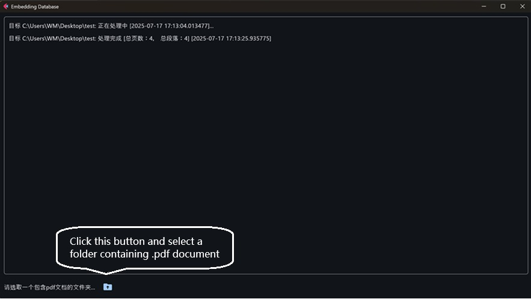

# RagSaveDoc guide

RagSaveDoc is a RAG tool which is used to embed .pdf/.txt documents to vector database.

## Environment setup

Step 1. Install python 3.12 or above.<br>
Step 2. Install necessary python module. Recommend to setup python virtual environment and intall modules with below commands.<br>
```
python -m venv myfletenv
myfletenv\Scripts\activate
pip install flet==0.28.3 asyncio==3.4.3 langchain==0.3.26 langchain-community==0.3.27 langchain-huggingface==0.3.0 langchain-chroma==0.2.4 jieba==0.42.1 openai==1.93.1 PyPDF2==3.0.1 rank-bm25==0.2.2 huggingface-hub==0.33.2 hf-xet==1.1.5 python-dateutil==2.9.0.post0 llama_cpp_python==0.3.12 PyMuPDF==1.26.3 PyYAML==6.0.2 requests==2.32.4 sentence-transformers==5.0.0 pyinstaller==6.14.2
```

## How to run in python environment

Step 1. Start cmd command prompt window and active python virtual environment with below command:
```
<myfletenv path>\Scripts\activate
```
Step 2. Go to ai-engine-direct-helper samples path and start ragsavedoc application with below command:
```
cd <your path>\ai-engine-direct-helper\samples
python fletui\GenieFletUI\windows\Ragtool\RagSaveDoc.py
```

## How to build ragsavedoc to Windows .exe file.

ragsavedoc can be built to Windows .exe file so that it can run without Python environment.<br>
Step 1. Start cmd command prompt window and active python virtual environment with below command:
```
<myfletenv path>\Scripts\activate
```
Step 2. Go to ai-engine-direct-helper ragsavedoc path and generate building .spec file with below command:
```
cd <your path>\ai-engine-direct-helper\samples\fletui\GenieFletUI\windows\Ragtool
python RagSaveDoc_generate_spec.py
```
Step 3. Build ragsavedoc with below command:
```
pyinstaller RagSaveDoc.spec
```
RagSaveDoc will be saved at <your path>\ai-engine-direct-helper\samples\fletui\GenieFletUI\windows\Ragtool\dist <br>

## Note

 - RagSaveDoc supports embedding model auto detection and downloading. So, first launch time may be longer because it will download embedding model. The following launch will be faster.
 - Saving a document which includes many pages may take long time. Application will show complete when saving done. Please be patient.
 
 - 