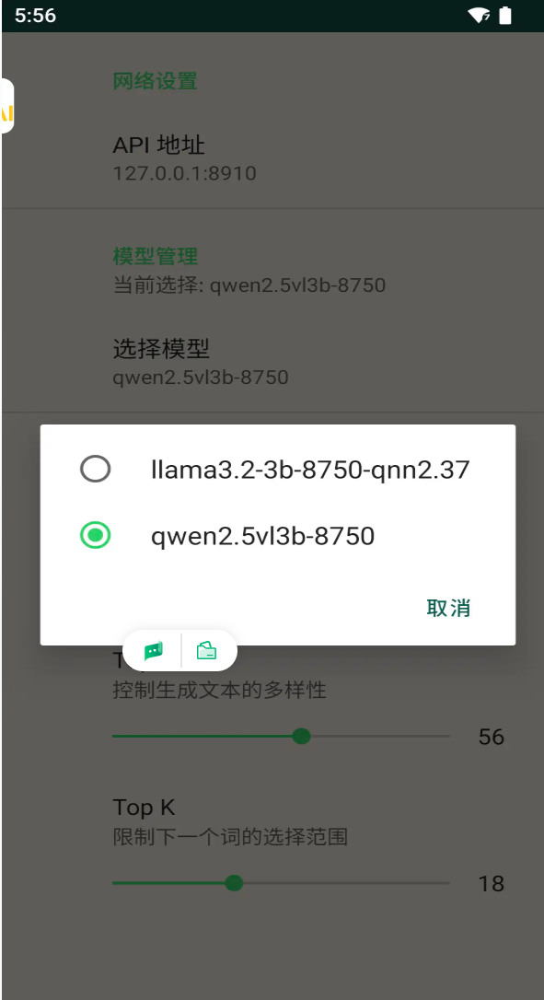
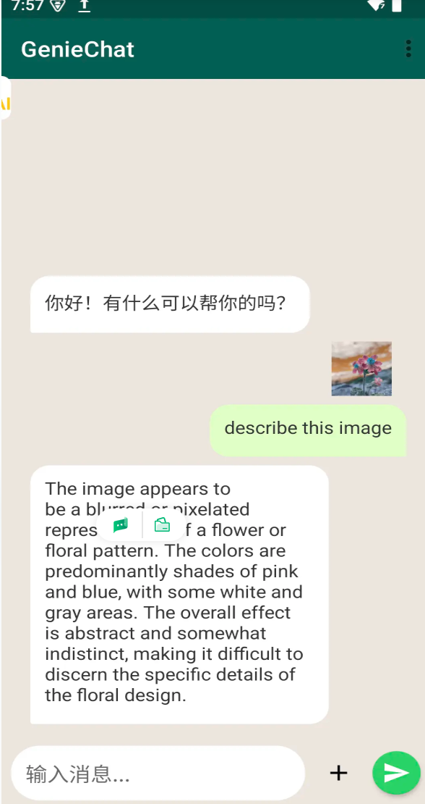

# Qwen2.5-VL-3B Model On-Device Deployment

## Part 1: Using on Windows Platform

This section explains how to configure and run the Qwen2.5-VL-3B model in a Windows environment.

### 1.1 Resource Download and Preparation

- **Download model files**:<br>
  Visit the website to download the model files for the corresponding
  platform: [Qwen2.5-VL-3B](https://www.aidevhome.com/?id=51) Model Download, and place
  the downloaded model in the `ai-engine-direct-helper\samples\genie\python\models` directory.

- **Download the Genie Service Program**:<br>
  Go to the GitHub Releases page to
  download [GenieAPIService_v2.1.4_QAIRT_v2.42.0_v73.zip](https://github.com/quic/ai-engine-direct-helper/releases/download/v2.42.0/GenieAPIService_v2.1.4_QAIRT_v2.42.0_v73.zip):
  Releases download page.

- **Extract the file**:<br>
  Unzip the downloaded compressed package into the project code directory `ai-engine-direct-helper\samples`.

### 1.2 Starting Services and Running Examples

Operation Steps: Open the terminal, navigate to the samples directory, and run the service and client commands
separately.

```
# 1. Entry the directory
cd ai-engine-direct-helper\samples

# 2. Start the GenieAPI Service (loading the config file)
GenieAPIService\GenieAPIService.exe -c "genie\python\models\qwen2.5vl3b\config.json" -l
 [W] load successfully! use second: 4.56947
 [W] Model load successfully: qwen2.5vl3b
 [W] GenieService::setupHttpServer start
 [W] GenieService::setupHttpServer end
 [A] [OK] Genie API Service IS Running.
 [A] [OK] Genie API Service -> http://0.0.0.0:8910

# 3. running the client for test(ensure test.png is existed in the current directory)
GenieAPIClient.exe --prompt "what is the image descript?" --img test.png --stream --model qwen2.5vl3b
```

Note: Please ensure test.png is existed in the current directory.

## Part 2: Using on Android Platform

### 2.1 Resource Download and Preparation

- **Download model files**:<br>
  Consistent with the Windows platform, please first download the model for the corresponding
  platform: [Qwen2.5-VL-3B](https://www.aidevhome.com/?id=51)
  model download, and place the downloaded model in the `/sdcard/GenieModels/` directory.


- **Download and Install APK**: <br>
  Visit the GitHub Releases page to
  download [GenieAPIService.apk](https://github.com/quic/ai-engine-direct-helper/releases/download/v2.42.0/GenieAPIService.apk)
  and install it on your Android device: Releases
  Download Page.

### 2.2 Example Application Compilation and Execution

The sample application source code for the Android platform is located in the project directory, and you need to compile
it yourself.

- **Source path**:
  `samples\android\GenieChat`


- **Instructions**:<br>
  Please open this directory using Android Studio, compile it, and install it on your device, then use it in
  conjunction with the already installed `GenieAPIService`.

### 2.3 Example Application Screenshots

Example in **Geniechat**





## Part 3: Python Calling Guide

Whether running GenieAPIService.exe on Windows or launching GenieAPIService.apk on Android, once the service starts
successfully, it will display an IP address and port (e.g., 127.0.0.1:8910 or the mobile phone's IP). We can then use
Python to call this service via the OpenAI-compatible interface.

### 3.1 Resource Download and Preparation

Please ensure the openai library is installed.

```pip install openai```

### 3.2 Python Calling Code (vl_client.py)

Create a Python script (e.g., vl_client.py) and copy the following code into it. Please modify the IP address according
to the actual situation.

```
import argparse
import base64
import requests # Added: used to download images from the web
import os
from openai import OpenAI

IP_ADDR = "127.0.0.1:8910"

parser = argparse.ArgumentParser()
parser.add_argument("--stream", action="store_true")
parser.add_argument("--prompt", default="Describe this image", type=str)
parser.add_argument("--image", required=True, type=str, help="Path to local image file or Image URL")
args = parser.parse_args()

# 1. Modified helper function: supports local paths and URLs
def encode_image(image_input):
    # Determine whether it's a URL
    if image_input.startswith(('http://', 'https://')):
        try:
            print(f"Downloading image from URL: {image_input}...")
            response = requests.get(image_input, timeout=10)
            response.raise_for_status() # Check that the request succeeded
            # Directly convert the downloaded binary content to Base64
            return base64.b64encode(response.content).decode('utf-8')
        except Exception as e:
            raise Exception(f"Failed to download image from URL: {e}")
   
    # Otherwise treat it as a local file
    else:
        try:
            if not os.path.exists(image_input):
                raise FileNotFoundError(f"Local file not found: {image_input}")
           
            with open(image_input, "rb") as image_file:
                return base64.b64encode(image_file.read()).decode('utf-8')
        except Exception as e:
            raise Exception(f"Failed to load local image: {e}")

# Obtain the Base64-encoded image
try:
    base64_image = encode_image(args.image)
except Exception as e:
    print(f"Error: {e}")
    exit(1)

client = OpenAI(base_url="http://" + IP_ADDR + "/v1", api_key="123")

# Construct the special message structure required by the Genie Service (VL model)
custom_messages = [
    {"role": "system", "content": "You are a helpful assistant."},
    {
        "role": "user",
        "content": {
            "question": args.prompt,  
            "image": base64_image     # Regardless of whether the source is a URL or local, send Base64 to the server here
        }
    }
]

extra_body = {
    "size": 4096,
    "temp": 1.5,
    "top_k": 13,
    "top_p": 0.6,
    "messages": custom_messages
}

model_name = "qwen2.5vl3b-8380-2.42" 
placeholder_msgs = [{"role": "user", "content": "placeholder"}]

# Send the request
try:
    if args.stream:
        response = client.chat.completions.create(
            model=model_name,
            stream=True,
            messages=placeholder_msgs,
            extra_body=extra_body
        )

        for chunk in response:
            if chunk.choices:
                content = chunk.choices[0].delta.content
                if content is not None:
                    print(content, end="", flush=True)
        print() # newline
    else:
        response = client.chat.completions.create(
            model=model_name,
            messages=placeholder_msgs,
            extra_body=extra_body
        )
        if response.choices:
            print(response.choices[0].message.content)

except Exception as e:
    print(f"\nRequest failed: {e}")

```

### 3.3 Running Script

Run the script in the command line, specifying the image path and (optional) prompt:

```
python vl_client.py --image test.png --prompt "what is image descript?" --stream
python vl_client.py --image "https://www.google.com/images/branding/googlelogo/2x/googlelogo_color_272x92dp.png" --prompt "What implies in this logo?"
```
