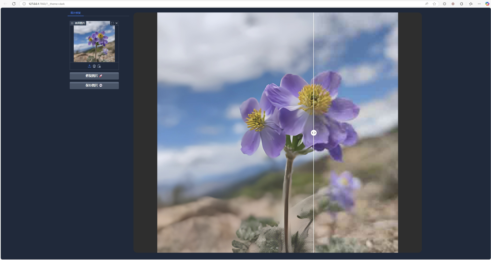
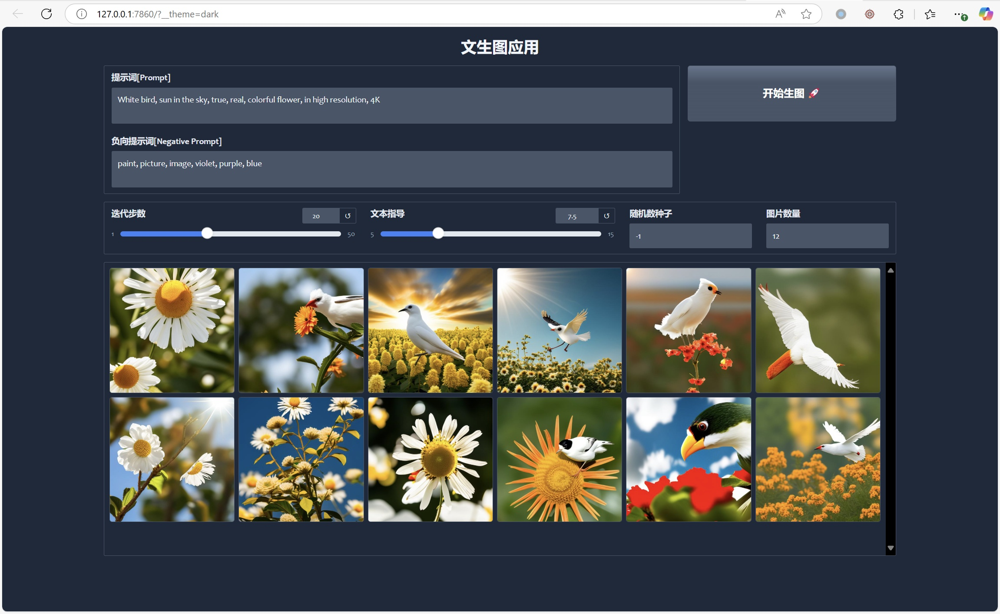
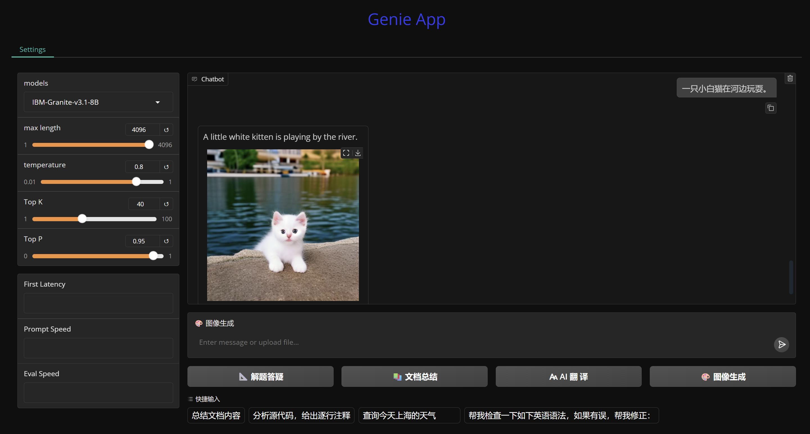

<br>

<div align="center">
  <h3>Run the WebUI AI application locally on NPU.</h3>
  <p><i> SIMPLE | EASY | FAST </i></p>
</div>
<br>

## Disclaimer
This software is provided “as is,” without any express or implied warranties. The authors and contributors shall not be held liable for any damages arising from its use. Due to limited resources, the code may be incomplete or insufficiently tested. Users are solely responsible for evaluating its suitability and assume all associated risks. <br>
Note: Contributions are welcome. Please ensure thorough testing before deploying in critical systems.

## Introduction 
These samples helps developers use QAI AppBuilder + Python Gradio extension to build *WebUI* AI apps on Windows on Snapdragon (WoS) platforms.

## Setting Up Environment For WebUI Apps:

### Step 1: Install basic dependencies
Refer to [python.md](../../docs/python.md) on how to setup x64 version Python environment.

### Step 2: Install basic Python dependencies for WebUI
Run below commands in Windows terminal:
```
pip install gradio
```

### Step 3: Switch to samples directory:
Run below commands in Windows terminal:
```
cd ai-engine-direct-helper\samples
```

### Step 4: Run WebUI Apps:
Run the commands in below table to start WebUI apps.

### WebUI App List:

|  Model   | Command  |
|  ----  | :----    |
| ImageRepairApp | python webui\ImageRepairApp.py |
| StableDiffusionApp * | python webui\StableDiffusionApp.py |
| GenieWebUI ** | python webui\GenieWebUI.py |

*. Refer to here to [setup Stable Diffusion v2.1 models](../python/README.md) before run 'GenieWebUI.py'. <br>
*. StableDiffusionApp only support English prompt.<br>
**. Refer to step 3 here to [setup LLM models](../genie/python/README.md) before run 'GenieWebUI.py'.<br>

### Screenshots:



